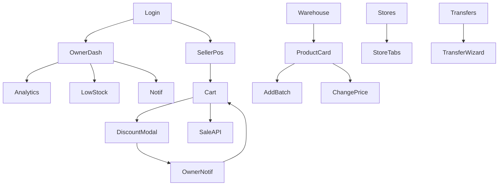

# UI Blueprint Document №13

**Проект:** AROMAT PLUS ERP  
**Версия:** 1.0  
**Статус:** Источник правды для всех экранов (экран за экраном)  
**Связанные документы:** [UX №3](ux-specification.md) · [UI Design System №4](ui-design-system.md) · [IA №15](ia-three-centers.md) · [Frontend №11](frontend-architecture.md) · [User Flows №8](user-flows.md) · [API №7](api-design.md) · [PWA №14](pwa-multi-surface.md)

> **Главная идея:** это не сайт и не «админка». Это **операционная система сети магазинов** — человек открывает утром и работает весь день внутри системы.  
> Доставка: **PWA** (одна кодовая база) — см. [№14](pwa-multi-surface.md).  
> Cursor / разработчик **не придумывает** UI: реализует этот Blueprint + Design System №4.

---

## 0. Принципы Blueprint

1. **Три поверхности** — Owner Desktop · Owner Mobile · Seller POS.  
2. **Три центра Owner** — Главная · Центральный склад · Магазины (см. [IA №15](ia-three-centers.md)). Меню по процессам, не по таблицам.  
3. **Нет корневого «Товары» / «Продажи»** — товары внутри склада; продажи внутри магазина + аналитика.  
4. **Dashboard** — только «сейчас»: KPI дня, внимание, лента.  
5. **Партии** не сливаются; sale price ≠ batch cost.  
6. **Скидка** только на текущий чек.  
7. **Фото** на бренде.  
8. **Два возврата:** покупатель (`/returns`) vs магазин→склад (`/warehouse/return-in`).  
9. **Архив** вместо мгновенного hard delete.  
10. **Ревизия blind:** факт у менеджера; ожидание только у Owner.  
11. White-label: Company settings.

---

## 1. Карта поверхностей

```
/login
   │
   ├─ OWNER / MANAGER
   │     ├─ viewport ≥ lg  → Owner Desktop Console
   │     └─ viewport < lg  → Owner Mobile Console
   └─ SELLER ──────────────→ Seller POS (PWA на телефоне)
```

| Поверхность | Shell | Nav |
|-------------|-------|-----|
| Owner Desktop | Sidebar + вложенный «Центральный склад» | Канон IA №15 |
| Owner Mobile | ☰ + sidebar (без bottom tabs) | Карточки |
| Seller POS | Full-screen + bottom bar | Продажа · История · Корзина · Уведомления · Профиль |

---

# ЧАСТЬ A — OWNER CONSOLE

## A-00. Shell владельца

### Layout

```
┌──────────┬────────────────────────────────┐
│  LOGO    │  [page title]     🔔           │
│          ├────────────────────────────────┤
│  nav…    │         CONTENT                │
│  (склад  │                                │
│   nested)│                                │
└──────────┴────────────────────────────────┘
```

### Sidebar — **канон (IA №15)**

| Пункт | URL | Примечание |
|-------|-----|------------|
| Главная | `/dashboard` | Центр 1 |
| Центральный склад ▾ | `/warehouse` | Центр 2 — раскрывающийся |
| → Остатки | `/warehouse` | default |
| → Категории | `/warehouse/categories` | |
| → Бренды | `/warehouse/brands` | |
| → Товары | `/warehouse/products` | |
| → Партии | `/warehouse/batches` | |
| → Перемещения | `/warehouse/transfers` | |
| → Возврат на склад | `/warehouse/return-in` | магазин → склад |
| → История склада | `/warehouse/history` | |
| Магазины | `/stores` | Центр 3 |
| Возвраты | `/returns` | только покупательские |
| Ревизии | `/revision` | |
| Аналитика | `/analytics` | |
| Пользователи | `/users` | permissions |
| Уведомления | `/notifications` | |
| Журнал действий | `/journal` | разделы журналов |
| Настройки | `/settings` | |

**Убрано из корня:** Продажи, Товары, Перемещения (как top-level), плоская «История».

Старые URL: `/transfers` → redirect `/warehouse/transfers`; `/sales` → hint на магазин/аналитику; `/history` → `/journal`; `/sellers` → `/users`.

### Mobile Owner

☰ → полный sidebar (IA №15).  
**Нижний tab bar не используется** (см. [Dashboard №13.1](dashboard-owner.md) §14).  
Списки на мобиле — карточки.
---

## A-01. Login — `/login`

| Элемент | Поведение |
|---------|-----------|
| Логотип компании | из Brand Settings |
| Логин | email / username |
| Пароль | mask |
| Войти | submit → role redirect |
| Ошибка | inline, без стека |

Нет регистрации.  
`mustChangePassword` → модалка/экран смены пароля до Console/POS.

---

## A-02. Dashboard — `/dashboard`

Полная спецификация: **[Dashboard Owner №13.1](dashboard-owner.md)**.

**Назначение:** центр контроля сети за 5–10 секунд. Не место операций (кроме инлайн approve).

### Блоки (порядок)

1. Header (дата/время live · уведомления · профиль · выход)  
2. **Сегодня** — KPI с 00:00 до сейчас + Δ к вчерашнему такому же интервалу  
3. **Требуют моего решения** ★ — скидки, возвраты, цены, списания (+ опц. партии); счётчик; Одобрить/Отклонить  
4. Важные уведомления (≤5)  
5. Магазины сегодня  
6. Товары, требующие внимания  
7. Последние действия (10) → журнал  
8. Быстрые переходы  

Auto-refresh: время 1с · решения/уведомления 10с · статистика 30с.  
Mobile: одна колонка; **без** Owner bottom nav.

---

## A-03. Аналитика — `/analytics`

Отдельный большой раздел. Dashboard сюда **не** дублирует P&L.

### Верхняя панель фильтров

1. Период: `Сегодня | Неделя | Месяц | Год | Своя дата`  
2. Контекст: `Все магазины` | select магазина  

Кнопка: **Применить** (или auto-apply).

### Сводка метрик (карточки)

- Доход  
- Прибыль (валовая / по формуле системы)  
- Расход  
- Количество продаж  
- Количество возвратов  
- Средний чек  
- Скидки (сумма одобренных)  
- Подарки (кол-во / себестоимость подарков)

### Топы

- ТОП товаров  
- ТОП брендов  
- ТОП категорий  
- (опц.) ТОП продавцов

### Блок P&L (главное)

```
Чистая / операционная база
− Аренда
− Зарплаты
− Прочие расходы
− Одобренные скидки
= ИТОГО
```

Числа: прибыль **зелёным**, расходы **красным (danger)**.  
Разбивка расходов кликабельна → `/stores/[id]` вкладка Расходы / expenses list.

### Пустые состояния

Нет данных за период → иллюстрация + «Измените период».

---

## A-04. Продажи (не top-level)

Корневого `/sales` в меню **нет**.

История продаж: `/stores/[id]?tab=sales`.  
Сводка по сети: `/analytics`.  
Детали чека: `/sales/[id]` (deep-link из магазина/журнала) — экран существует, пункта меню нет.

---

## A-05. Центральный склад — `/warehouse`

**Центр 2 · приоритетный модуль.** Полная спецификация: **[№16](warehouse-central.md)**.

Подразделы (вкладки/subnav): Обзор · Каталог · Остатки · Категории · Бренды · Партии · Поступление · Отправка · Возврат на склад · Списание · История.

Инварианты: партии не merge · FIFO · цена продажи ≠ cost партии · archive вместо hard delete · Seller без доступа.

---

## A-06. Карточка товара — `/products/[id]` (alias `/warehouse/[id]`)

Отдельная страница, не модалка.

### Шапка

```
[Фото бренда]   Название
                Бренд · Категория · Тип
                ID: 000125 · Артикул: ARM-000125
                Штрихкод · QR
                Остаток (склад / по магазинам summary)
                Текущая цена продажи: [  ] [Изменить цену]
```

### Кнопки

Изменить · Добавить партию · Печать этикетки · Переместить · История · (архив)

### Блок «Партии» (таблица)

| Партия | Дата прихода | Кол-во | Себестоимость | Примечание |
|--------|--------------|-------|---------------|-----------|
| #1 | … | 100 | **100** сом. | read-only cost |
| #2 | … | 50 | **120** сом. | |

**Инварианты UI:**

- ❌ нельзя «слить» партии;  
- ❌ нельзя переписать себестоимость старой партии из карточки «цены продажи»;  
- ✅ «Изменить цену» открывает диалог **только sale price** + запись в PriceHistory;  
- история уже совершённых продаж не меняется.

### Блок «История» (вкладки внутри карточки)

Цены · Перемещения · Продажи (агрегат) · Изменения карточки

### Фото — правило

Фото привязано к **Brand** (или BrandLine / «модель»):

```
Brand: Dior  →  одно фото
  └ Product: Sauvage, Elixir, Parfum, EDT  → наследуют фото бренда
```

На карточке товара показывается `product.brand.imageUrl`. Загрузка фото — в Настройки → Бренды / карточка бренда. Не плодить файл на каждую SKU без нужды.

---

## A-07. Товары (каталог) — `/products`

Список каталога (может совпадать со складом по UX, но акцент на карточках без складских qty-операций).  
Либо редирект на `/warehouse` с tab «Каталог» — **решение реализации:** один список с режимами `Остатки | Каталог`, чтобы не дублировать таблицы. Blueprint допускает:

- **Вариант A (предпочтительно):** `/warehouse` = остатки+поиск; `/products/[id]` = карточка; пункт «Товары» ведёт на `/products` = grid карточек.  
- **Вариант B:** «Товары» = alias склада.

Канон для кода: **Вариант A**.

---

## A-08. Торговые точки — `/stores`

**Обязательное ТЗ:** [Документ №15 v2.0](stores-module.md).  
Owner Direct: [№17](owner-direct-sales.md).

Список: спец. карточка владельца + филиалы с полным KPI-набором §2.  
Вкладки филиала: Обзор · Остатки · Продавцы · История продаж/скидок/возвратов/ревизий · Запросы · Настройки.  
Удаление запрещено — только архив. Остатки только из движений склада.

---

## A-09. Перемещения — `/transfers`

Список: дата · склад → магазин · статус · кто.  
`+ Новое перемещение` → wizard:

1. Склад-источник  
2. Магазин  
3. Товары + qty (проверка остатка партий FIFO)  
4. Подтвердить  

Результат: склад − · магазин + · история.

---

## A-10. Возвраты

### Покупатель — `/returns`

Seller создаёт запрос → Owner approve → товар **в магазин**.

### Магазин → склад — `/warehouse/return-in`

Операция склада (не продаётся / брак / закрытие / пересортировка).  
Магазин − · центральный склад +.

---

## A-11. Ревизии — `/revision`

Blind count: сотрудник вводит **только факт** (не видит «ожидалось»).

Owner открывает акт:

```
Ожидалось 130 мл · Фактически 125 мл · Расхождение −5 мл
```

Поля: дата · магазин/склад · сотрудник · подтверждающий · комментарий · причина · итог.

---

## A-12. Журнал действий — `/journal`

Разделы (не один список):

Действия · Склад · Цены · Пользователи · Скидки · Возвраты · Ревизии · Уведомления  

Запись: дата · время · кто · роль · что · где · комментарий · было/стало.

Пример:

```
28.07.2026  12:34  Менеджер  Изменил цену  Dior Sauvage  100 → 110
```

`/history` → redirect `/journal`.

---

## A-13. Пользователи — `/users`

Таблица: имя · роль · магазин · статус · последний вход.  
`+ Создать`

Форма: имя · роль · магазин · логин · временный пароль | Сгенерировать.

После save: пароль **не показывается** снова. Только «Сбросить пароль».

Роли UI: Owner · Manager · Seller (+ Warehouse).

---

## A-14. Уведомления — `/notifications`

**Центр уведомлений** с цветовой семантикой:

| Цвет | Тип |
|------|-----|
| Красный (danger/brand alert) | заканчивается товар, критично |
| Синий (info) | новая партия, системное |
| Жёлтый (warning) | ожидает скидка / возврат |
| Зелёный (success) | возврат подтверждён, скидка одобрена |

Действия: Открыть объект · Отметить прочитанным · «Одобрить» inline для pending discount/return.

Пороги low-stock — в Настройках.

---

## A-15. Настройки — `/settings`

| Подраздел | Содержание |
|-----------|------------|
| Компания | имя, лого, theme (white-label) |
| Личный кабинет | профиль Owner |
| Безопасность | логин, пароль, **2FA**, активные устройства, «завершить все сеансы» |
| Резервные копии | |
| Уведомления | пороги по категориям |
| Права пользователей | permissions менеджеров |
| Пороги остатков | |
| Интеграции | v2 |
| Справочники | типы, единицы (категории/бренды также во вкладках склада) |
| Архив | срок хранения soft-delete |

### Архив

Удалить → в архив (срок из настроек) → hard delete или оставить. Без мгновенной потери.

---

## A-16. Модалки Owner (общие)

| Modal | Поля | Confirm |
|-------|------|---------|
| Change sale price | newPrice, comment | пишет PriceHistory |
| Reset password | temp password / generate | mustChangePassword |
| Approve discount | comment optional | |
| Reject discount | reason | |
| Approve return | | stock + |
| Add batch | qty, cost, date, note | never merge |
| Confirm transfer | summary | |

Escape / overlay click = cancel (если нет dirty warning).

---

# ЧАСТЬ B — SELLER POS

## B-00. Shell продавца

Совершенно другой UI. Не уменьшенный Owner.

### Bottom nav — **ровно 5 пунктов**

| # | Пункт | URL |
|---|--------|-----|
| 1 | Продажа | `/pos` |
| 2 | История | `/pos/history` |
| 3 | Корзина | `/pos/cart` (badge = count) |
| 4 | Уведомления | `/pos/notifications` (badge) |
| 5 | Профиль | `/pos/profile` |

Нет: аналитика, склад сети, себестоимость, другие магазины, настройки справочников.

---

## B-01. Продажа — `/pos` (главная)

**Цель:** продажа за 10–15 секунд, ≤3 касания в типичном сценарии.

### Структура экрана

```
┌─────────────────────────────┐
│ 🔍 Поиск / сканер QR·штрих │
├─────────────────────────────┤
│ Категории (гориз. chips)    │
├─────────────────────────────┤
│ Быстрые товары (grid)       │
│ [фото бренда] Название      │
│ цена · есть N шт            │
│ [ + ]                       │
├─────────────────────────────┤
│ FAB / bar: Корзина (N) · Σ  │
└─────────────────────────────┘
```

### Поиск

Одно поле: название · бренд · категория · ID · артикул · QR · штрих-код.  
Результат: имя · **цена продажи** · доступно в **своём** магазине · [Добавить].

### Добавить

+1 в Zustand cart. Toast короткий. Остаток на клиенте optimistic, сервер валидирует при Продать.

---

## B-02. Корзина — `/pos/cart`

```
Dior Sauvage     − 1 +     150
Часы             − 1 +     300
─────────────────────────────
Итого                    450

[ Запросить скидку ]
[ ПРОДАТЬ ]   ← primary brand, full width
```

Если gift rule сработала (после check API или при Продать): баннер «Подарок: Дезодорант».

### Продать

`POST /sales` → success screen (сумма, опц. печать) → очистить корзину → `/pos`.

Ошибка остатка → подсветка строки.

---

## B-03. Запрос скидки (modal на корзине)

```
Текущая цена:  165
Желаемая:      [ 140 ]
Комментарий:   [ … ]
[ Отправить ]
```

Статус в корзине: «Ожидает владельца…» / «Одобрено — 140» / «Отклонено».

После approve: **только итог этого чека** меняется. Каталожная цена товара в системе **не** меняется.

---

## B-04. История продавца — `/pos/history`

Список своих продаж: дата · сумма · позиции (кратко).  
Тап → детали (без cost).  
Отсюда: «Запросить возврат» → форма → PENDING.

---

## B-05. Уведомления продавца — `/pos/notifications`

Те же цвета семантики. Типично: скидка одобрена/отклонена, объявления Owner, low stock своего магазина (без себестоимости).

---

## B-06. Профиль — `/pos/profile`

| Можно | Нельзя |
|-------|--------|
| Сменить пароль | Менять логин |
| Язык / фото профиля | Видеть cost / analytics |
| Выйти | |

Логин меняет только Owner.

---

# ЧАСТЬ C — Идентификаторы и медиа

## C-01. Коды товара

Каждый Product:

| Поле | Пример | Назначение |
|------|--------|------------|
| internalId / sequential | `000125` | короткий ID |
| sku / article | `ARM-000125` | артикул |
| barcode | EAN / Code128 | этикетка, сканер |
| qrPayload | internal URL/id | внутренние операции |

UI генерации: Настройки/карточка → «Сгенерировать штрихкод» · «Печать».

## C-02. Фото

| Уровень | Фото |
|---------|------|
| Brand | **да** (основное) |
| Product SKU | нет по умолчанию (опц. override позже) |

---

# ЧАСТЬ D — Переходы (ключевые)



---

# ЧАСТЬ E — Соответствие текущему коду

| Blueprint | Сейчас |
|-----------|--------|
| Sidebar порядок A-00 | обновить `OWNER_NAV` |
| Dashboard «сейчас» | частично; упростить / добавить ленту действий |
| Analytics P&L | stub |
| Store tabs | страница есть, вкладки доработать |
| Product card + batches | warehouse/[id] есть |
| Brand photo | схема/UI — доработать |
| Seller 5-tab POS | layout stub; полный flow ⏳ |
| Unified search | API search доработать |

**Правило внедрения:** новый экран = сначала строка в этом Blueprint, потом код.

---

## Итог

UI Blueprint фиксирует операционную систему из двух продуктов:

1. **Owner Console** — управление сетью весь день.  
2. **Seller POS** — продажа за секунды.

Реализация идёт **по этому документу**, а не по догадкам модели. Следующий шаг после утверждения: привести shell/nav и Dashboard к A-00 / A-02, затем Milestone 2 (POS).
