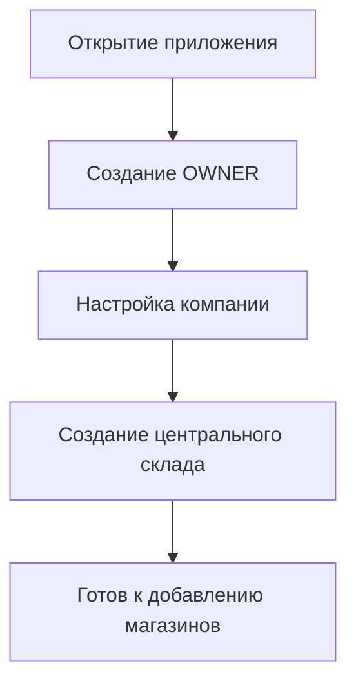
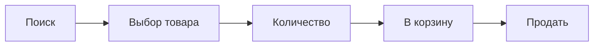
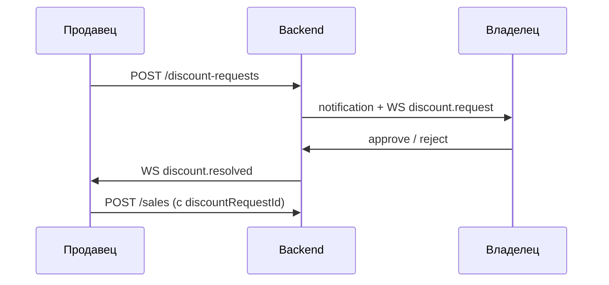

# User Flow Document №8

**Проект:** ARAMAT PLUS ERP  
**Версия:** 1.0  
**Статус:** Сценарии работы пользователей в реальной системе  
**Связанные документы:** [Vision](vision.md) · [UX №3](ux-specification.md) · [API №7](api-design.md) · [Database №6](database-design.md)

---

## 1. Общая логика работы системы

Главный принцип:

```
Центральный склад → Магазины → Продажи → Аналитика
```

Все master-данные о товарах начинаются со склада.

```
Поставщик
   ↓
Центральный склад (+ партии)
   ↓
Филиалы / магазины
   ↓
Продавцы
   ↓
Продажи
   ↓
Аналитика владельца
```

---

## 2. Пользовательские роли

### 2.1 Владелец (OWNER)

Доступ:

- все магазины и склады;
- цены и себестоимость;
- аналитика и расходы;
- сотрудники и права;
- история действий;
- подтверждение возвратов и скидок.

### 2.2 Менеджер склада (WAREHOUSE_MANAGER)

Может:

- принимать товар / создавать партии;
- отправлять товар в магазины;
- инвентаризация склада;
- просмотр себестоимости партий (для учёта).

Не может:

- видеть сетевую прибыль / полную аналитику Owner;
- управлять правами Owner;
- подтверждать скидки/возвраты (если не делегировано).

### 2.3 Менеджер (MANAGER)

Права назначает Owner (магазины и/или склад) — см. UX §22.

### 2.4 Продавец (SELLER)

Только свой магазин. Может: поиск, продажа, корзина, запрос скидки/возврата, своя история, остатки своего магазина (если разрешено), профиль.

**Не видит:** себестоимость, закупочную цену, прибыль, другие магазины, склад, настройки, аналитику сети.

---

## 3. Первый запуск системы



### Шаг 1 — Аккаунт владельца

Имя · Телефон · Email · Пароль  

(Bootstrap / seed или мастер первого запуска.)

### Шаг 2 — Компания

- Название: ARAMAT PLUS  
- Логотип  
- Валюта: сомони (TJS)  
- Часовой пояс: Asia/Dushanbe  

### Шаг 3 — Центральный склад

«Добавить склад» → название «Главный склад» → адрес → **Центральный склад создан**.

---

## 4. Добавление магазина

```
Владелец → Магазины → Добавить магазин
```

Поля: название, адрес, телефон, ответственный менеджер (опционально).

Пример: `AROMAT PLUS №1`, Душанбе.  
Результат: магазин в списке сети, готов к привязке продавцов и остаткам.

---

## 5. Создание продавца

```
Владелец → Пользователи → Добавить сотрудника
Роль: Продавец
Имя · Магазин · Логин/Email · Временный пароль (или «Сгенерировать»)
```

Связь: **Продавец → Магазин №1** (обязательна).

### Первый вход продавца

1. Ввод логина и временного пароля.  
2. Редирект в интерфейс магазина (Seller POS).  
3. **Обязательная смена пароля** (`mustChangePassword`).  
4. Далее: может менять **пароль**, язык, фото профиля.  

**Логин/email** меняет только Owner (UX §20) — чтобы не ломать поиск сотрудника в аудите.  
Новый пароль только как hash; Owner его не видит. Забыл → Owner: «Сбросить пароль».

---

## 6. Добавление категорий

```
Владелец → Настройки / Категории
```

Пример дерева:

```
Парфюм
 ├ Мужской
 ├ Женский
 └ Унисекс
Часы
Дезодоранты
Освежители
```

У категории — порог низкого остатка (по умолчанию).

---

## 7. Добавление бренда

```
Владелец → Бренды → Добавить
```

Имя (Dior) + фото бренда (опционально).

---

## 8. Добавление товара

```
Владелец / Кладовщик → Склад → Добавить товар
```

Поля: название, бренд, категория, тип (штучный / мл / г), фото, цена продажи.

Система создаёт:

- внутренний ID / артикул (`AR-000001`);
- штрих-код (авто или вручную).

Без партии остаток = 0, пока не оформлена поставка.

---

## 9. Поступление новой партии

Критичный процесс — партии **не смешиваются**.

### Закуп 1

```
Dior Sauvage · 100 шт · себестоимость 100 · продажа 150
→ Партия №1
```

### Через неделю — закуп 2

```
50 шт · себестоимость 120 · продажа 180 (обновляет текущую цену товара)
→ Партия №2
```

В системе:

```
Партия 1: 100 @ 100
Партия 2:  50 @ 120
```

Текущая цена продажи на карточке товара = последняя установленная (180).  
Старые продажи не пересчитываются.

API: `POST /products/:id/batches` (+ опционально price).

---

## 10. Перемещение товара в магазин

```
Кладовщик / Owner → Склад → Передача товара
Откуда: Центральный склад
Куда: Магазин №1
Товар: Dior Sauvage · 20 шт
→ Подтвердить
```

Результат:

- склад −20 (FIFO по партиям);
- магазин +20 (новые партии с той же себестоимостью);
- Transfer + StockMovement + Audit (кто, когда, куда, qty).

Realtime: `inventory.updated`.

---

## 11. Работа продавца (старт дня)

Продавец открывает **телефон** (PWA).

Bottom nav:

```
Главная · Продажа · Корзина · Уведомления · Профиль
```

(История / возвраты / остатки — из Главной или Профиля / меню.)

---

## 12. Поиск товара

Единая строка поиска на экране продажи:

| Способ | Пример |
|--------|--------|
| Название | `Dior` → Dior Sauvage |
| ID / артикул | `000001` / `AR-000001` |
| Штрих-код | камера / сканер |
| Категория | фильтр «Мужской парфюм» |

API: `GET /products/search?q=`

---

## 13. Создание продажи (без скидки)



Корзина: позиции, qty, сумма по **цене продажи** (без себестоимости на экране).

Цель UX: типовая продажа ≈ **3 действия**.

---

## 14. Проверка подарков

Перед «Продать» (или при изменении корзины):

```
POST /promotions/check
```

Пример правила Owner: купил ≥ 200 мл → подарок «Dior Deo».

UI продавцу:

> Покупателю положен подарок: Dior Deo  

Подарок добавляется в чек как `isGift` (себестоимость учитывается в аналитике Owner, продавцу не показывается).

---

## 15. Запрос скидки



Продавец: «Запросить скидку» → итог корзины → желаемая цена → комментарий.  
Статус: PENDING → APPROVED / REJECTED.  

При одобрении цена применяется **только к этой продаже**; прайс в каталоге не меняется.

---

## 16. Завершение продажи

«Продать» → `POST /sales`.

Система атомарно:

1. Списывает товар (FIFO на магазине).  
2. Создаёт Sale + SaleItems (snapshots).  
3. Считает прибыль (в БД / для Owner).  
4. Audit + analytics side-effects.  
5. WS `sale.created`, `inventory.updated`.  
6. Чек / экран успеха у продавца.

---

## 17. Возврат товара

```
Продавец → История продаж → продажа → Запрос возврата → причина
→ Owner: approve / reject
→ При approve: остаток +, коррекция аналитики, история возврата
```

Продавец **не** возвращает товар сам без Owner.

---

## 18. Проведение ревизии

```
Ответственный → Ревизия → Создать
Магазин · (категория) · дата
По системе: 100 | Факт: 97 | Разница: −3
Причина · комментарий · подтверждение → акт
```

ADJUSTMENT + Audit + уведомление при необходимости.

---

## 19. Аналитика владельца

```
Владелец → Аналитика
Период: Сегодня | Неделя | Месяц | Год | произвольный
Область: вся сеть | магазин
```

По магазину / сети: продажи, qty, выручка, расходы (−), скидки, **чистая прибыль** (зелёный).

Пример:

```
Магазин №1
Продажи: 10 000 с.
Расходы: −3 500 с.
Чистая прибыль: 6 500 с.
```

Не путать с Dashboard (утренняя сводка) — глубокая аналитика только здесь.

---

## 20. Уведомления

Автоматически:

| Событие | Пример |
|---------|--------|
| Низкий остаток | Dior Sauvage осталось 5 шт/мл |
| Скидка | Продавец запросил скидку |
| Возврат | Новый запрос возврата |
| Ревизия / поставка | … |

Цвета по UI Design System (🔴🟡🟢🔵).

---

## 21. История действий

Всё значимое пишется в Audit.

Пример:

```
12.08.2026 14:35 | Ахмад (или Owner)
PRICE_CHANGE | Dior Sauvage | 150 → 170
```

Журналы (глобальные + в карточке магазина):

- продажи, возвраты, скидки;
- пользователи;
- склад / перемещения;
- цены;
- ревизии.

---

## 22. Главный принцип безопасности

Каждый видит только разрешённое:

| Роль | Контур данных |
|------|----------------|
| Продавец | Свой магазин, цена продажи, свои продажи |
| Кладовщик | Склад, партии, перемещения |
| Владелец | Вся сеть |

APIenforce: чужой `storeId` → 403.

---

## 23. Итоговый пользовательский путь (end-to-end)

```
Владелец создаёт систему
  → склад
  → магазины
  → сотрудники
  → категории / бренды / товары
  → партии (поставки)
  → перемещения в магазины
  → продавцы продают (+ скидки / подарки / возвраты)
  → система считает прибыль
  → владелец анализирует бизнес
```

---

## 24. Краткие flow-карточки (для разработки)

| ID | Flow | Актёры | Ключевые API |
|----|------|--------|--------------|
| UF-01 | Первый запуск | Owner | setup / seed |
| UF-02 | Создать магазин | Owner | POST /stores |
| UF-03 | Создать продавца + первый вход | Owner, Seller | POST /users, auth |
| UF-04 | Справочники | Owner | categories, brands |
| UF-05 | Создать товар | Owner/WH | POST /products |
| UF-06 | Новая партия | Owner/WH | POST …/batches |
| UF-07 | Перемещение | Owner/WH | POST /transfers |
| UF-08 | Продажа | Seller | search, POST /sales |
| UF-09 | Подарок | Seller, system | /promotions/check |
| UF-10 | Скидка | Seller, Owner | discount-requests |
| UF-11 | Возврат | Seller, Owner | /returns |
| UF-12 | Ревизия | Owner/Manager | inventory sessions |
| UF-13 | Аналитика | Owner | /analytics |
| UF-14 | Сброс пароля | Owner, Seller | reset + change |

---

## 25. Связь с нумерацией документов

| № | Документ | Статус |
|---|----------|--------|
| 6 | Database Design | Уже готов (`database-design.md`) |
| 7 | API Design | Уже готов (`api-design.md`) |
| 8 | **User Flow** (этот файл) | Готов |
| — | Business Process Specification (BPS) | Рекомендуется следующим: формализация UF-01…14 с условиями/ошибками |
| — | Prisma schema v2 | Миграции по пробелам из №6 |

> В черновике «№9 Database Architecture» = по сути уже выполненный **№6 Database Design**. Дублировать не нужно — при необходимости расширять №6.

---

## Итог

User Flow описывает **как люди реально проходят систему** от запуска сети до ежедневных продаж и аналитики.

Инварианты сценариев:

1. Всё начинается со склада и партий.  
2. Продавец — только телефон и свой магазин, без себестоимости.  
3. Скидки и возвраты — только через Owner.  
4. Каждое действие — в истории.  
5. Партии никогда не сливаются.
